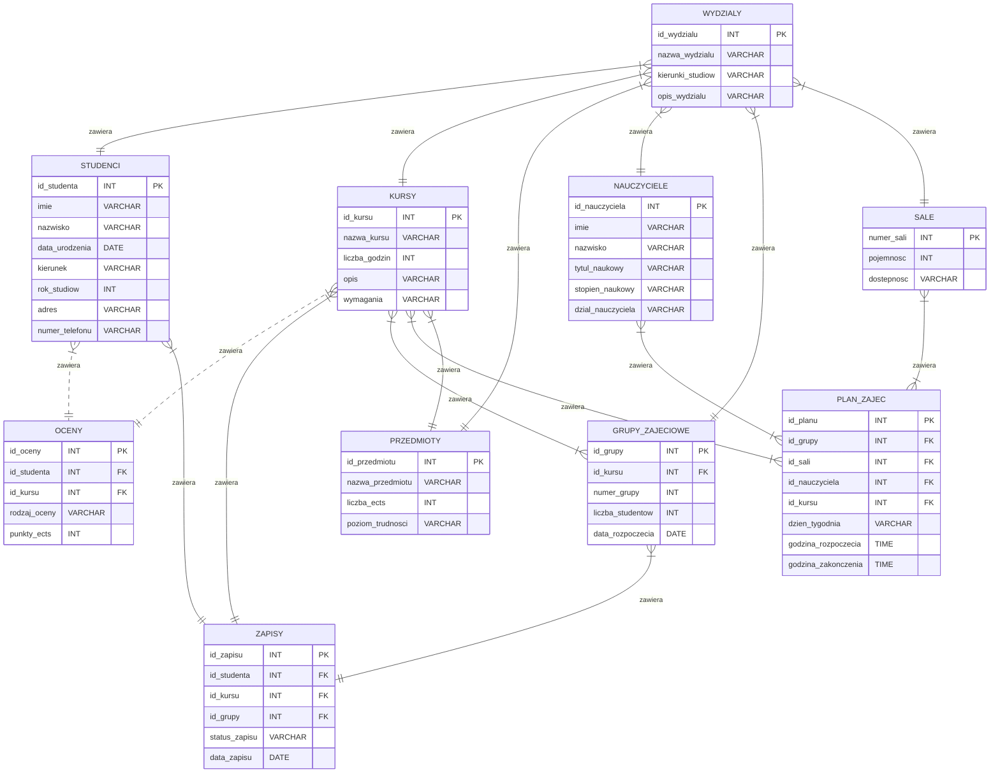

# Treść zadania
Projekt architektury bazy danych obsługującej procesy związane z kształceniem w uczelni wyższej. <br />
Przykładowe tabele: (studenci, wykładowcy, przedmioty, kursy, kierunki, plan zajęć, egzaminy, oceny itp.)

Projektując bazę należy wykorzystać formaty nierelacyjne (dokumentowe, przestrzenne, grafowe).<br /> 
Uzasadnienie wykorzystanie danego formatu - mile widziane.

**Projekt powinien uwzględniać min. 10 obiektów (tabel) wraz z powiązaniami.** 
<br />
<br />

# Schemat bazy danych


# Wykorzystanie nierelacyjnej bazy danych

Biorąc pod uwagę strukturę i relacje między tabelami, tabela "OCENY" byłaby najłatwiejsza do przeniesienia do MongoDB.
Wynika to z faktu, że tabela ta składa się tylko z kilku kolumn i nie zawiera złożonych relacji z innymi tabelami.<br /> 

W MongoDB można by utworzyć kolekcję "oceny", a każdy dokument w tej kolekcji mógłby przechowywać informacje o ocenie jednego studenta w danym przedmiocie. Na przykład, dokument może mieć następującą strukturę:

```
{
  "id_studenta": 1,
  "id_kursu": 1,
  "ocena": 4.5,
  "semestr": "zimowy",
  "rok": 2022
}
```


Taka struktura pozwoliłaby na łatwe wyszukiwanie ocen studentów dla konkretnych przedmiotów, semestrów lub lat. Ponadto, MongoDB jest idealnym wyborem do przechowywania danych nierelacyjnych, co oznacza, że łatwo można by dodać nowe pola do dokumentów lub zmienić strukturę kolekcji, jeśli zajdzie taka potrzeba.