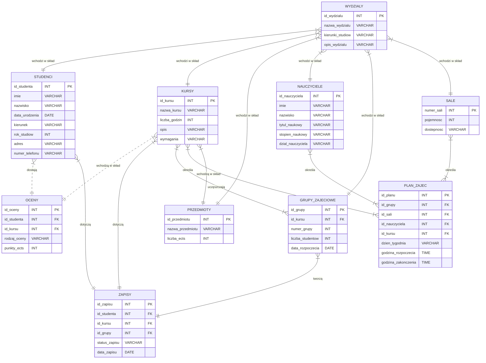

# Treść zadania
Projekt architektury bazy danych obsługującej procesy związane z kształceniem w uczelni wyższej. <br />
Przykładowe tabele: (studenci, wykładowcy, przedmioty, kursy, kierunki, plan zajęć, egzaminy, oceny itp.)

Projektując bazę należy wykorzystać formaty nierelacyjne (dokumentowe, przestrzenne, grafowe).<br /> 
Uzasadnienie wykorzystanie danego formatu - mile widziane.

**Projekt powinien uwzględniać min. 10 obiektów (tabel) wraz z powiązaniami.** 
<br />
<br />

# Schemat bazy danych

Powyższy diagram ER przedstawia relacje między tabelami obecnymi w systemie zarządzania uniwersytetem:

- Tabela `STUDENCI` przechowuje informacje o studentach, takie jak ich imię, nazwisko, datę urodzenia, kierunek studiów, rok studiów, adres i numer telefonu.

- Tabela `KURSY` przechowuje informacje o kursach, takie jak nazwa kursu, liczba godzin, opis i wymagania.

- Tabela `OCENY` przechowuje informacje o ocenach studentów, takie jak rodzaj oceny i liczba punktów ECTS. Tabela ta zawiera klucze obce do tabel STUDENCI i KURSY.

- Tabela `NAUCZYCIELE` przechowuje informacje o nauczycielach, takie jak ich imię, nazwisko, tytuł naukowy, stopień naukowy i dział nauczyciela.

- Tabela `SALE` przechowuje informacje o salach, takie jak pojemność i dostępność.

- Tabela `WYDZIALY` przechowuje informacje o wydziałach, takie jak nazwa, kierunki studiów i opis.

- Tabela `ZAPISY` przechowuje informacje o zapisach studentów na kursy. Tabela ta zawiera klucze obce do tabel STUDENCI, KURSY i GRUPY_ZAJECIOWE.

- Tabela `PRZEDMIOTY` przechowuje informacje o przedmiotach, takie jak nazwa, liczba punktów ECTS i poziom trudności.

- Tabela `GRUPY_ZAJECIOWE` przechowuje informacje o grupach zajęciowych, takie jak numer grupy, liczba studentów i data rozpoczęcia. Tabela ta zawiera klucz obcy do tabeli `KURSY`.

- Tabela `PLAN_ZAJEC` przechowuje informacje o planie zajęć, takie jak dzień tygodnia, godzina rozpoczęcia i zakończenia zajęć. Tabela ta zawiera klucze obce do tabel `GRUPY_ZAJECIOWE`, `SALE`, `NAUCZYCIELE` i `KURSY`.

Diagram ER pokazuje, że tabela STUDENCI i KURSY zawierają wiele rekordów, które są powiązane z rekordami w tabeli OCENY. Tabela STUDENCI i KURSY zawierają również wiele rekordów, które są powiązane z rekordami w tabeli ZAPISY. Tabela KURSY zawiera wiele rekordów, które są powiązane z rekordami w tabeli GRUPY_ZAJECIOWE i PLAN_ZAJEC. 

# Wykorzystanie nierelacyjnej bazy danych

Biorąc pod uwagę strukturę i relacje między tabelami, tabela "OCENY" byłaby najłatwiejsza do przeniesienia do MongoDB.
Wynika to z faktu, że tabela ta składa się tylko z kilku kolumn i nie zawiera złożonych relacji z innymi tabelami.<br /> 

W MongoDB można by utworzyć kolekcję "oceny", a każdy dokument w tej kolekcji mógłby przechowywać informacje o ocenie jednego studenta w danym przedmiocie. Na przykład, dokument może mieć następującą strukturę:

```
{
  "id_studenta": 1,
  "id_kursu": 1,
  "ocena": 4.5,
  "semestr": "zimowy",
  "rok": 2022
}
```


Taka struktura pozwoliłaby na łatwe wyszukiwanie ocen studentów dla konkretnych przedmiotów, semestrów lub lat. Ponadto, MongoDB jest idealnym wyborem do przechowywania danych nierelacyjnych, co oznacza, że łatwo można by dodać nowe pola do dokumentów lub zmienić strukturę kolekcji, jeśli zajdzie taka potrzeba.
