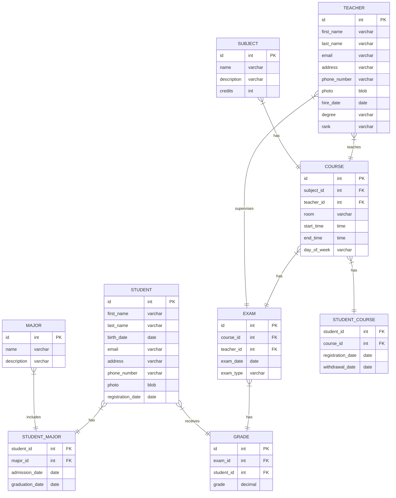

```mermaid
erDiagram
    STUDENT {
        id int PK
        first_name varchar
        last_name varchar
        birth_date date
        email varchar
        address varchar
        phone_number varchar
        photo blob
        registration_date date
    }
    TEACHER {
        id int PK
        first_name varchar
        last_name varchar
        email varchar
        address varchar
        phone_number varchar
        photo blob
        hire_date date
        degree varchar
        rank varchar
    }
    SUBJECT {
        id int PK
        name varchar
        description varchar
        credits int
    }
    COURSE {
        id int PK
        subject_id int FK
        teacher_id int FK
        room varchar
        start_time time
        end_time time
        day_of_week varchar
    }
    MAJOR {
        id int PK
        name varchar
        description varchar
    }
    STUDENT_MAJOR {
        student_id int FK
        major_id int FK
        admission_date date
        graduation_date date
    }
    EXAM {
        id int PK
        course_id int FK
        teacher_id int FK
        exam_date date
        exam_type varchar
    }
    GRADE {
        id int PK
        exam_id int FK
        student_id int FK
        grade decimal
    }
    STUDENT_COURSE {
        student_id int FK
        course_id int FK
        registration_date date
        withdrawal_date date
    }

    STUDENT }|--|| STUDENT_MAJOR : has
    MAJOR }|--|| STUDENT_MAJOR : includes
    TEACHER }|--|| COURSE : teaches
    SUBJECT }|--|| COURSE : has
    COURSE }|--|| STUDENT_COURSE : has
    COURSE }|--|| EXAM : has
    TEACHER }|--|| EXAM : supervises
    EXAM }|--|| GRADE : has
    STUDENT }|--|| GRADE : receives
```